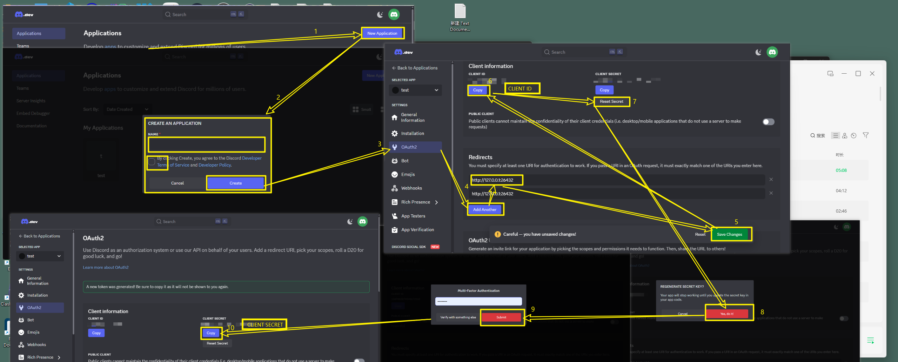

## Setting up your Discord application

1. Visit the [Discord Developer Portal](https://discord.com/developers/applications) and log in
2. Click "New Application" in the top right and give it a name</li>
3. Once created, navigate to the "OAuth2" section in the left sidebar
4. Under "Client information", you'll find your **Client ID**
5. Click "Reset Secret" to generate a new **Client Secret**
6. Scroll down to "Redirects" and click "Add Redirect"</li>
7. Enter the URL `http://127.0.0.1:26432`
8. Click "Save Changes" at the bottom</li>
9. Copy your Client ID and Client Secret into the fields of the popup

